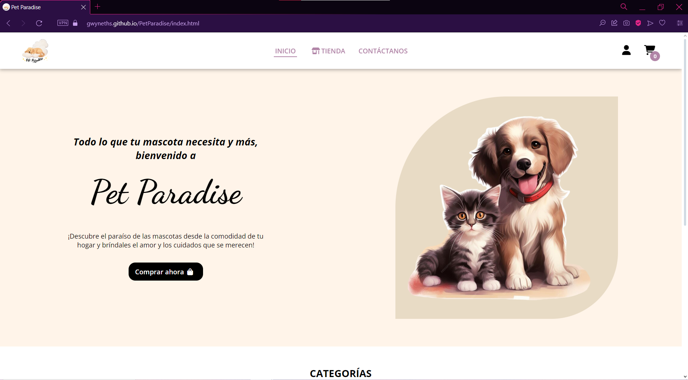
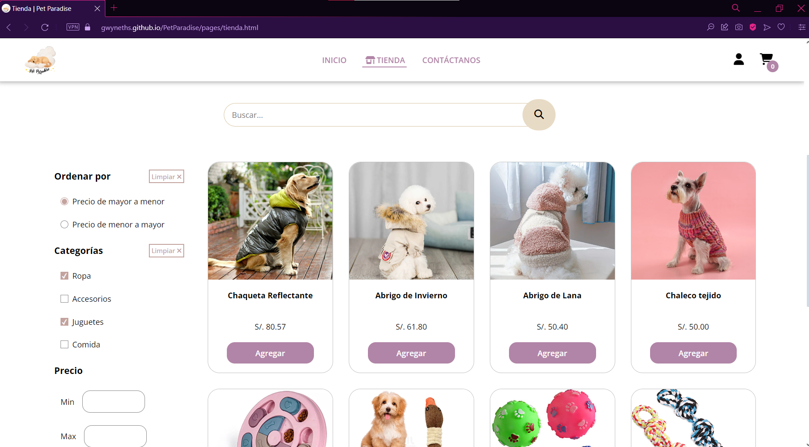
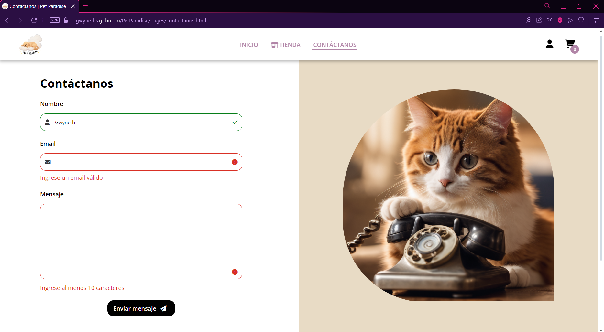
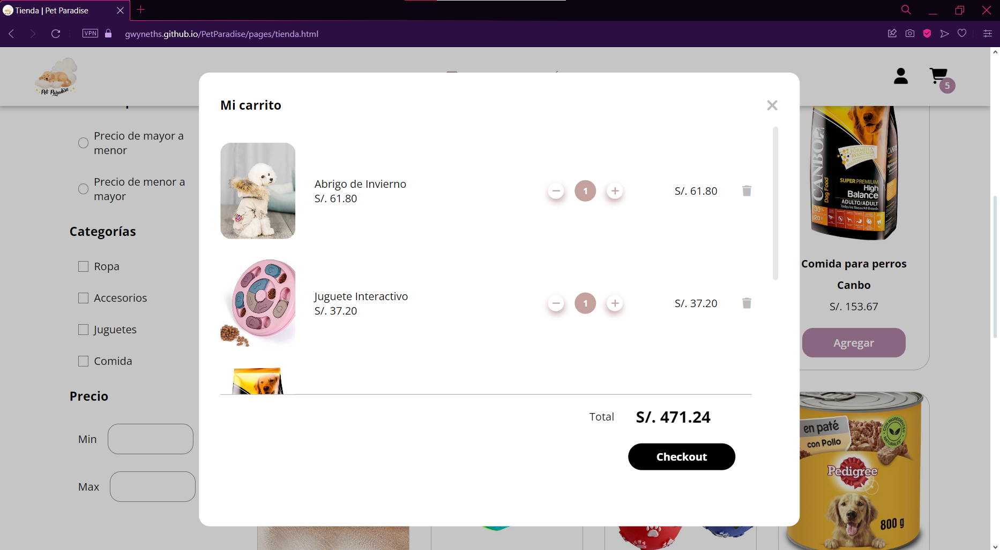
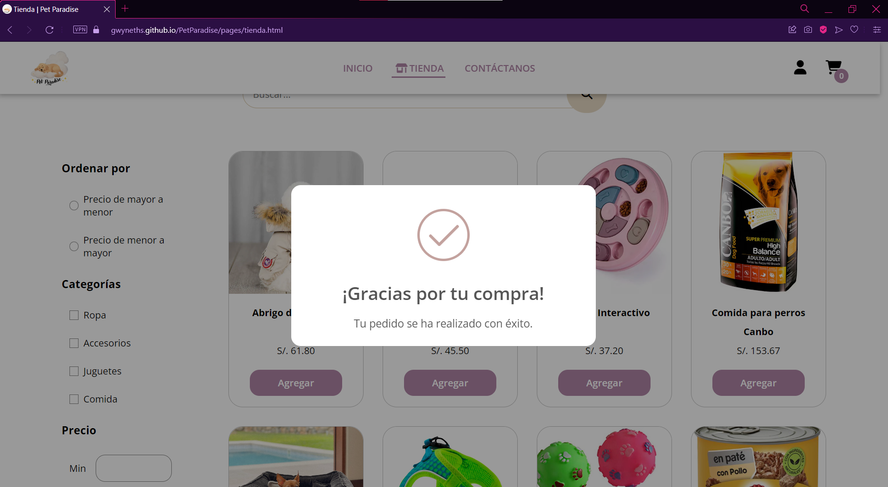

# 🐶 PetParadise

PetParadise es una tienda en línea para mascotas desarrollada como proyecto final del curso de JavaScript. La plataforma permite a los usuarios navegar, buscar y comprar productos para sus mascotas.

## 📝 Descripción

PetParadise es una aplicación web interactiva desarrollada con HTML, CSS, Sass y JavaScript. El proyecto incluye características como la navegación por categorías de productos, un carrito de compras, y una simulación de pago.

## ✅ Funcionalidades

- **Navegación por Productos:** Los usuarios pueden buscar, filtrar productos por categorías y precio, realizar ordenamientos.
- **Carrito de Compras:** Los usuarios pueden agregar y eliminar productos del carrito de compras.
- **Simulación de Pago:** La plataforma incluye una simulación de pago para completar las compras.
- **Despliegue:** La aplicación está desplegada en GitHub Pages.

## 💡 Tecnologías Utilizadas

- **Frontend:** HTML, CSS, Sass, JavaScript
- **Herramientas de Desarrollo:** Git, GitHub

## 👩🏻‍💻 Uso

1. Visita [PetParadise en GitHub Pages](https://tuusuario.github.io/petparadise/) para ver la aplicación desplegada.
2. Navega por el catálogo de productos.
3. Agrega productos al carrito de compras.
4. Da *click* al botón ***checkout*** para completar la compra.

## 📸 Ejecución

Página de Inicio

Página de la Tienda

Página de Contacto

Carrito de compras

Mensaje de compra

